# SushiSwap / Uniswap V2 & V3 — Contract Flows

> Minimal, essential reference for understanding how V2 and V3 AMM contracts work, their key functions, and how they interact.

---

## Table of Contents

1. [V2 Architecture Overview](#v2-architecture-overview)
2. [V2 Contract Flows](#v2-contract-flows)
   - [Pair Creation](#v2-pair-creation)
   - [Add Liquidity (Mint)](#v2-add-liquidity-mint)
   - [Remove Liquidity (Burn)](#v2-remove-liquidity-burn)
   - [Swap](#v2-swap)
   - [Flash Swap](#v2-flash-swap)
3. [V3 Architecture Overview](#v3-architecture-overview)
4. [V3 Contract Flows](#v3-contract-flows)
   - [Pool Creation](#v3-pool-creation)
   - [Initialize Pool](#v3-initialize-pool)
   - [Add Liquidity (Mint)](#v3-add-liquidity-mint)
   - [Remove Liquidity (Burn + Collect)](#v3-remove-liquidity-burn--collect)
   - [Swap](#v3-swap)
   - [Flash Loan](#v3-flash-loan)
5. [V2 vs V3 — Key Differences](#v2-vs-v3--key-differences)
6. [Key Formulas](#key-formulas)

---

## V2 Architecture Overview

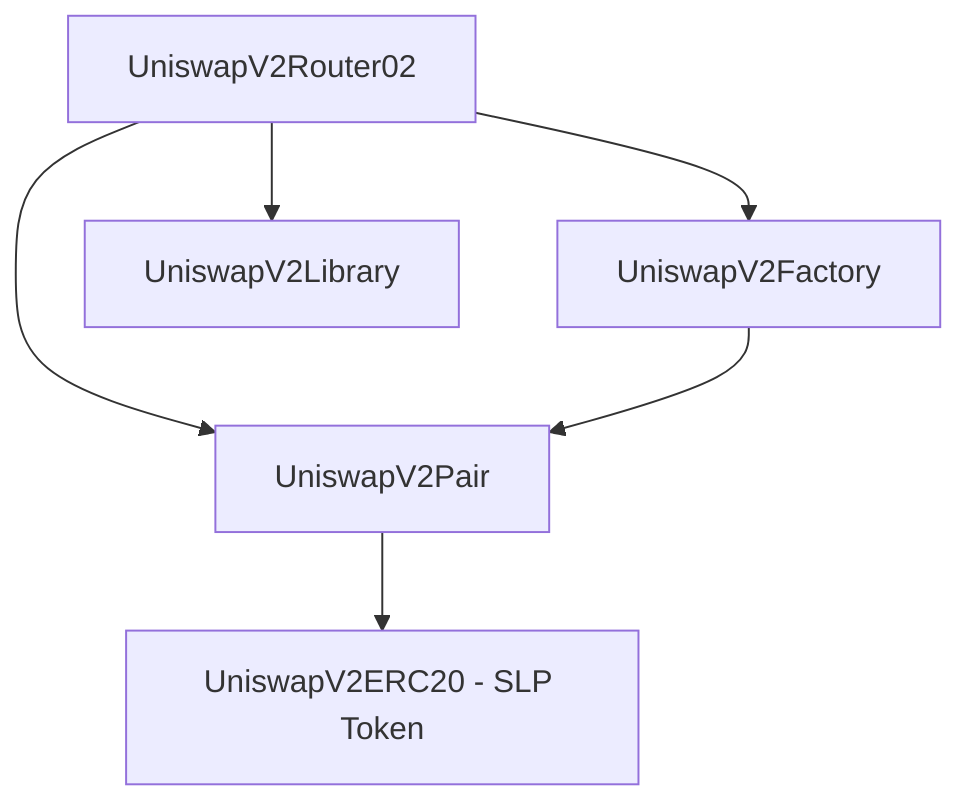

### Contracts

| Contract                                                               | Role                                                                    |
| ---------------------------------------------------------------------- | ----------------------------------------------------------------------- |
| [`UniswapV2Factory`](v2-core/contracts/UniswapV2Factory.sol)           | Deploys and tracks all pair contracts via `CREATE2`                     |
| [`UniswapV2Pair`](v2-core/contracts/UniswapV2Pair.sol)                 | Core AMM pool — holds reserves, issues SLP tokens                       |
| [`UniswapV2ERC20`](v2-core/contracts/UniswapV2ERC20.sol)               | LP token logic (SLP), supports EIP-712 `permit`                         |
| [`UniswapV2Router02`](v2-core/contracts/UniswapV2Router02.sol)         | User-facing entry point — wraps low-level pair calls with safety checks |
| [`UniswapV2Library`](v2-core/contracts/libraries/UniswapV2Library.sol) | Pure helper: `getAmountOut`, `getAmountIn`, `pairFor`, `quote`          |

---

## V2 Contract Flows

### V2 Pair Creation

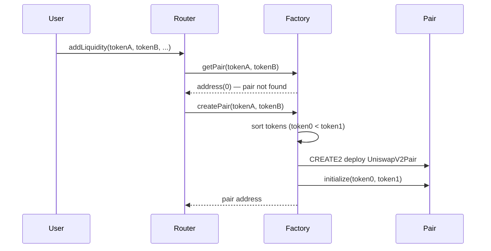

**Key points:**

- `CREATE2` salt = `keccak256(token0, token1)` — deterministic address
- Pair address computable off-chain using `pairFor()` in the library
- One pair per `(token0, token1)` — no fee tiers in V2

---

### V2 Add Liquidity (Mint)

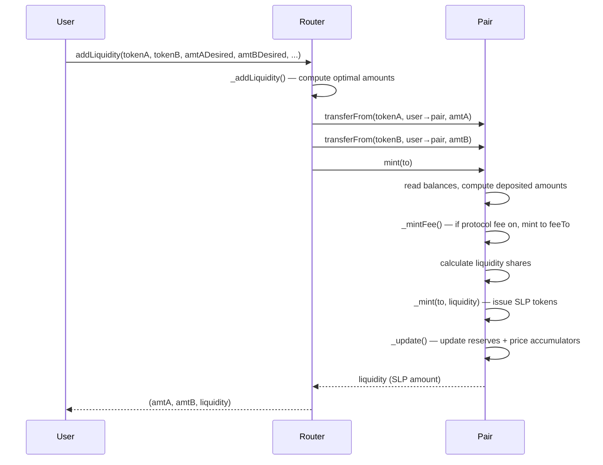

**First deposit special case:**

- `liquidity = sqrt(amount0 * amount1) - MINIMUM_LIQUIDITY`
- `MINIMUM_LIQUIDITY` (1000 wei) permanently burned to `address(0)` — prevents price manipulation

**Subsequent deposits:**

- `liquidity = min(amount0 * totalSupply / reserve0, amount1 * totalSupply / reserve1)`

---

### V2 Remove Liquidity (Burn)

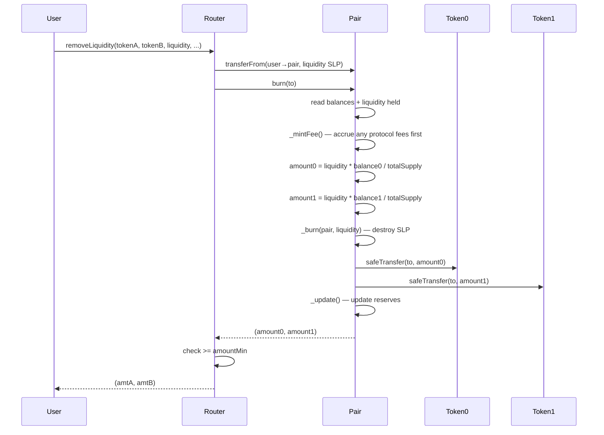

---

### V2 Swap

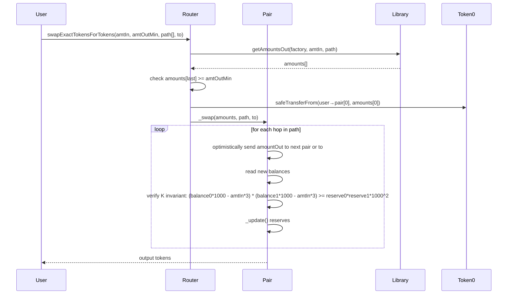

**Fee:** 0.3% (hardcoded) — `amountInWithFee = amountIn * 997`

**Constant Product:** `x * y = k` must hold (with fee adjustment)

**Formula:**

```
amountOut = (amountIn * 997 * reserveOut) / (reserveIn * 1000 + amountIn * 997)
```

**Multi-hop:** Router chains pairs — output of pair[i] is sent directly to pair[i+1]

---

### V2 Flash Swap

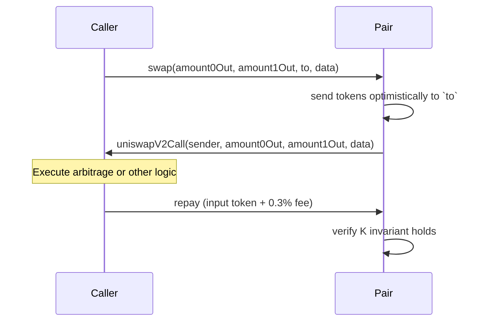

- If `data.length > 0`, pair calls `IUniswapV2Callee(to).uniswapV2Call()` — enabling flash swaps
- Caller must repay before the transaction ends or it reverts

---

## V3 Architecture Overview

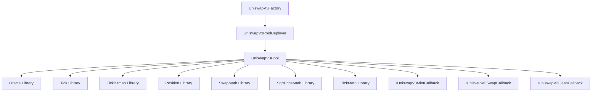

### Contracts & Libraries

| Contract / Library                                                     | Role                                                   |
| ---------------------------------------------------------------------- | ------------------------------------------------------ |
| [`UniswapV3Factory`](v3-core/contracts/UniswapV3Factory.sol)           | Deploys pools, manages fee tiers and owner             |
| [`UniswapV3PoolDeployer`](v3-core/contracts/UniswapV3PoolDeployer.sol) | Transient parameter storage for pool constructor       |
| [`UniswapV3Pool`](v3-core/contracts/UniswapV3Pool.sol)                 | Core pool — concentrated liquidity, tick-based pricing |
| [`Tick`](v3-core/contracts/libraries/Tick.sol)                         | Per-tick state, fee growth tracking, cross logic       |
| [`TickBitmap`](v3-core/contracts/libraries/TickBitmap.sol)             | Efficient bitmap to find next initialized tick         |
| [`Position`](v3-core/contracts/libraries/Position.sol)                 | Per-position state (liquidity, fees owed)              |
| [`Oracle`](v3-core/contracts/libraries/Oracle.sol)                     | TWAP observations ring buffer                          |
| [`SwapMath`](v3-core/contracts/libraries/SwapMath.sol)                 | Computes step amounts within a tick range              |
| [`SqrtPriceMath`](v3-core/contracts/libraries/SqrtPriceMath.sol)       | Token amounts from sqrt price deltas                   |
| [`TickMath`](v3-core/contracts/libraries/TickMath.sol)                 | Convert tick ↔ sqrtPriceX96                            |

### Fee Tiers (default)

| Fee         | Tick Spacing | Use Case       |
| ----------- | ------------ | -------------- |
| 0.05% (500) | 10           | Stable pairs   |
| 0.3% (3000) | 60           | Standard pairs |
| 1% (10000)  | 200          | Exotic pairs   |

---

## V3 Contract Flows

### V3 Pool Creation

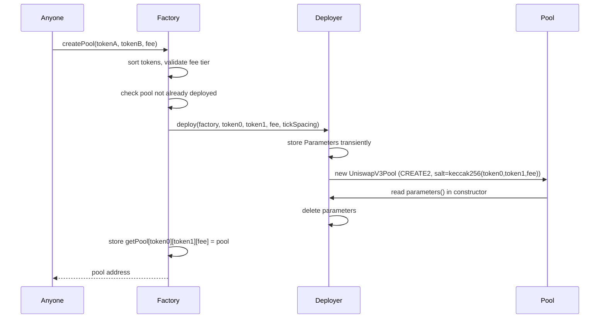

**Key difference from V2:** Multiple pools per token pair — one per fee tier

---

### V3 Initialize Pool

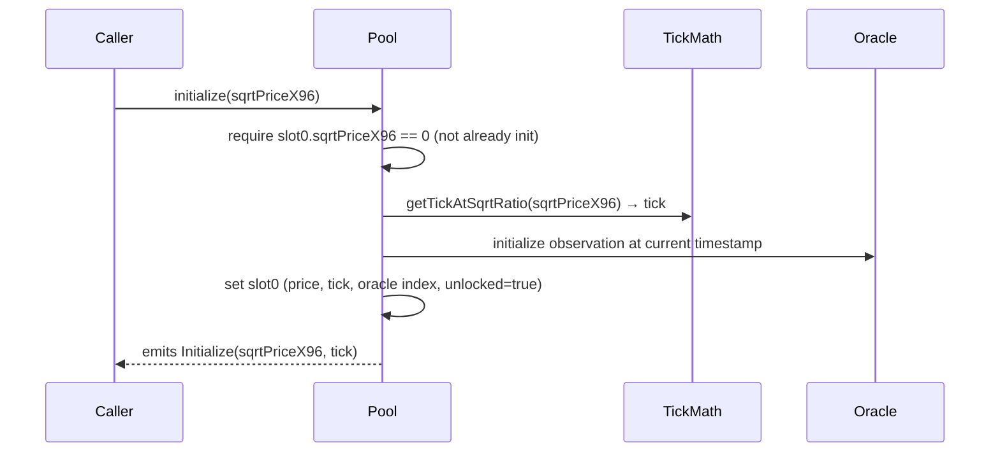

- Must be called before any `mint` or `swap`
- `sqrtPriceX96` = `sqrt(price) * 2^96` (Q64.96 fixed-point)

---

### V3 Add Liquidity (Mint)

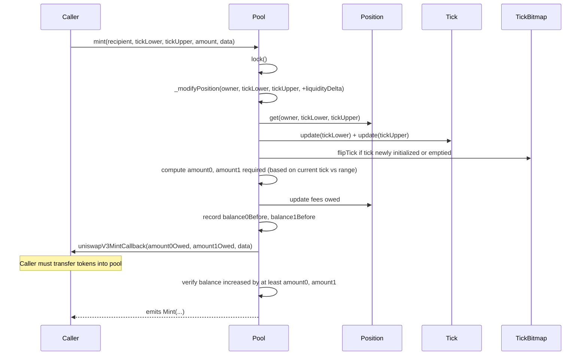

**Callback pattern:** Pool calls back `msg.sender` to pull tokens — no pre-approval to router needed at pool level

**Amount calculation depends on current tick position:**

| Current Tick vs Range | Token Required         |
| --------------------- | ---------------------- |
| Below `tickLower`     | Only token0            |
| Inside range          | Both token0 and token1 |
| Above `tickUpper`     | Only token1            |

---

### V3 Remove Liquidity (Burn + Collect)

V3 separates removal into **two steps**:

#### Step 1 — Burn (remove liquidity, credit fees owed)

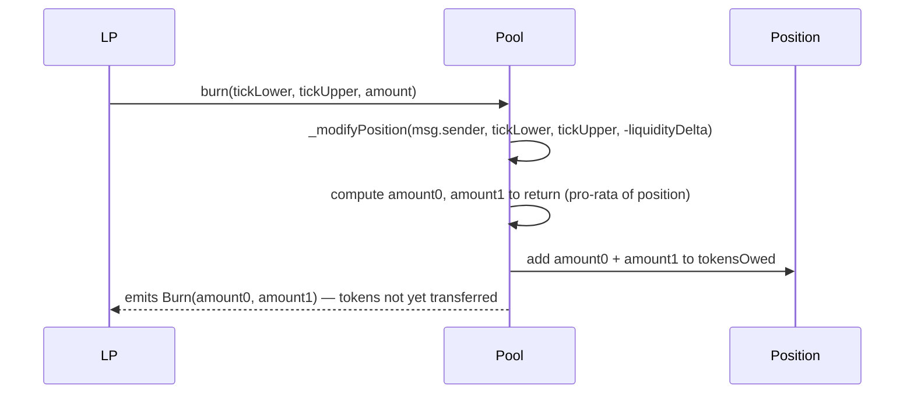

#### Step 2 — Collect (actually withdraw tokens + fees)

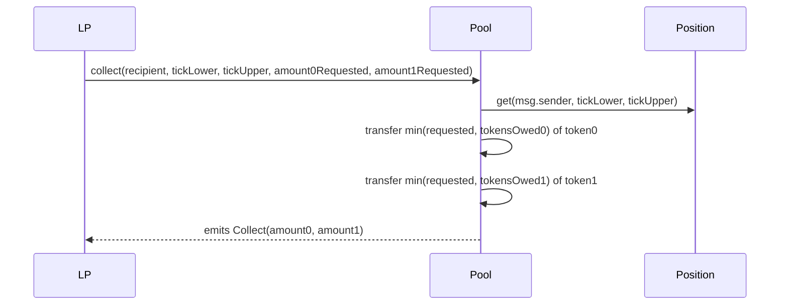

> **Why two steps?** `burn()` decrements liquidity and accrues fees into `tokensOwed`. `collect()` actually transfers. This lets LPs accrue fees without removing liquidity.

---

### V3 Swap

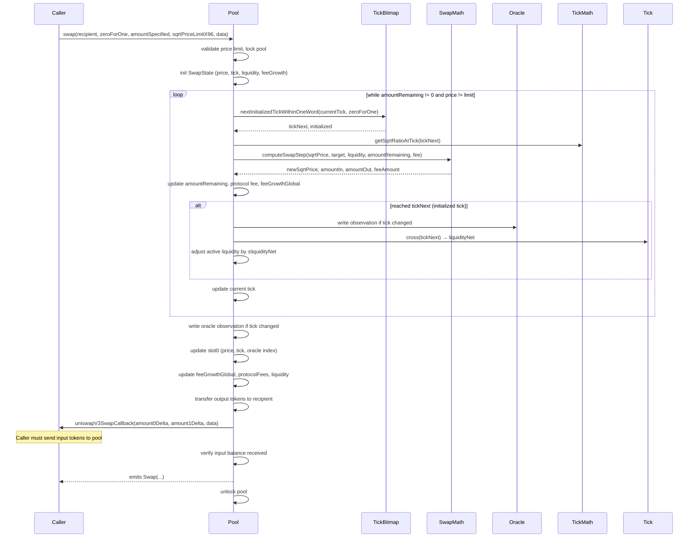

**Swap direction:**

- `zeroForOne = true` → selling token0 for token1 (price decreases)
- `zeroForOne = false` → selling token1 for token0 (price increases)

**Exact input vs exact output:**

- `amountSpecified > 0` → exact input (pay exactly, receive at least)
- `amountSpecified < 0` → exact output (receive exactly, pay at most)

**Tick crossing:** When price crosses an initialized tick, `liquidity` is adjusted by `liquidityNet` of that tick — activating or deactivating position ranges.

---

### V3 Flash Loan

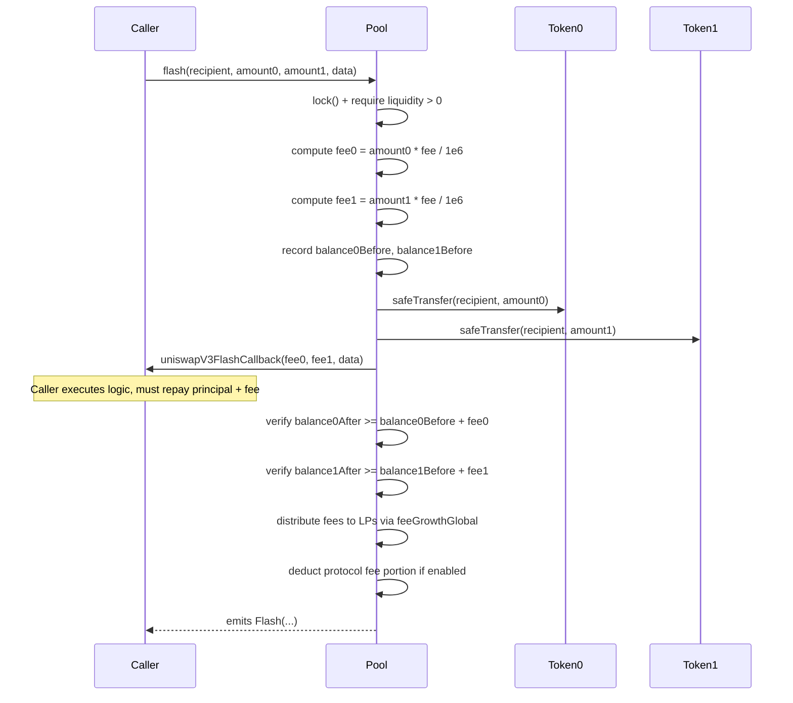

---

## V2 vs V3 — Key Differences

| Feature                  | V2                             | V3                                                     |
| ------------------------ | ------------------------------ | ------------------------------------------------------ |
| **Liquidity model**      | Full range (0 → ∞)             | Concentrated within `[tickLower, tickUpper]`           |
| **Fee tiers**            | Fixed 0.3%                     | 0.05% / 0.3% / 1% (extendable)                         |
| **LP token**             | ERC20 SLP token (fungible)     | NFT position (non-fungible via periphery)              |
| **Price representation** | `reserve0`, `reserve1`         | `sqrtPriceX96` (Q64.96 fixed-point)                    |
| **Oracle**               | Cumulative price per block     | Ring buffer of up to 65535 observations (TWAP)         |
| **Pool per pair**        | 1                              | Multiple (one per fee tier)                            |
| **Swap callback**        | Optional (`IUniswapV2Callee`)  | Required (`IUniswapV3SwapCallback`)                    |
| **Flash loans**          | Via `swap()` + callee          | Dedicated `flash()` function                           |
| **Remove liquidity**     | Single `burn()` tx             | Two-step: `burn()` then `collect()`                    |
| **Protocol fee**         | 1/6 of LP fee (off by default) | Configurable 1/N of LP fee per token                   |
| **Pool deployer**        | `CREATE2` in Factory           | Separate `UniswapV3PoolDeployer` with transient params |
| **Reentrancy guard**     | `uint unlocked` flag           | `slot0.unlocked` bool in packed storage                |

---

## Key Formulas

### V2 Constant Product AMM

```
x * y = k
amountOut = (amountIn * 997 * reserveOut) / (reserveIn * 1000 + amountIn * 997)
```

### V2 Liquidity (first deposit)

```
liquidity = sqrt(amount0 * amount1) - MINIMUM_LIQUIDITY
```

### V2 Price Accumulators (TWAP)

```
price0Cumulative += (reserve1 / reserve0) * timeElapsed   [UQ112x112]
price1Cumulative += (reserve0 / reserve1) * timeElapsed
```

### V3 Price Representation

```
sqrtPriceX96 = sqrt(token1/token0) * 2^96    [Q64.96]
price = (sqrtPriceX96 / 2^96)^2
```

### V3 Tick ↔ Price

```
price = 1.0001 ^ tick
tick  = floor(log(price) / log(1.0001))
```

### V3 Fee Growth

```
feeGrowthGlobalX128 += (feeAmount * Q128) / liquidity
tokensOwed += liquidity * (feeGrowthInside - feeGrowthInsideLast)
```

### V3 Flash Fee

```
fee = ceil(amount * poolFee / 1_000_000)
```
